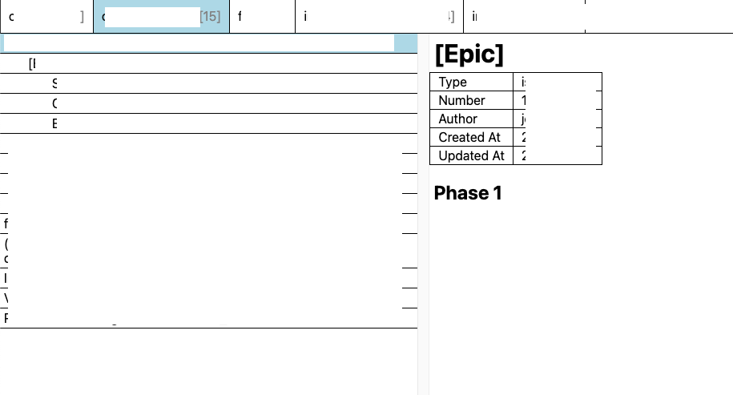

## What did I do?

### Problem
I made the mistake of quitting my job before updating my resume. By the time I had to update my resume, I mostly forgot all the details involved with the work I did. Although too lazy to update my resume while I was still at work, I had the foresight that this was going to be a problem so I pulled down Github issues/PRs before quitting. However, I still had trouble reading through them because they are just a bunch of JSON files. I wanted to organize them in a way such that similar issues/PRs are grouped together. So I created this tool.

### Demo
Unfortunately, everything is redacted.
You have two panes. The left pane shows the root level issues. If there are issues/PRs that refer the root level issue, they will be shown as a dropdown (I followed the show/hide functionality from HackerNews' comment thread). The right pane shows the content of the issue/PR.

### Getting started
First, pull all issues/PRs from repos that you've worked on using the Github API. This could be done by running `yarn pull-from-remote`.

You have to provide some details such as `Github API Token`, `Organization`, `Repositories`.

After pulling the data, run `yarn create-tree` to create a tree structure that could be parsed by the frontend. `src/data.js` should be created.

The last step is to run `yarn start`. This will open a html page locally and display all the issues/PRs you've worked on in one place.

### How does it work?
It picks up keywords such as `Fixes`, `Part of`, `Related to` and also bullet lists to find relations between issues/PRs. It creates a tree based on the relations and displays the information on a web page.